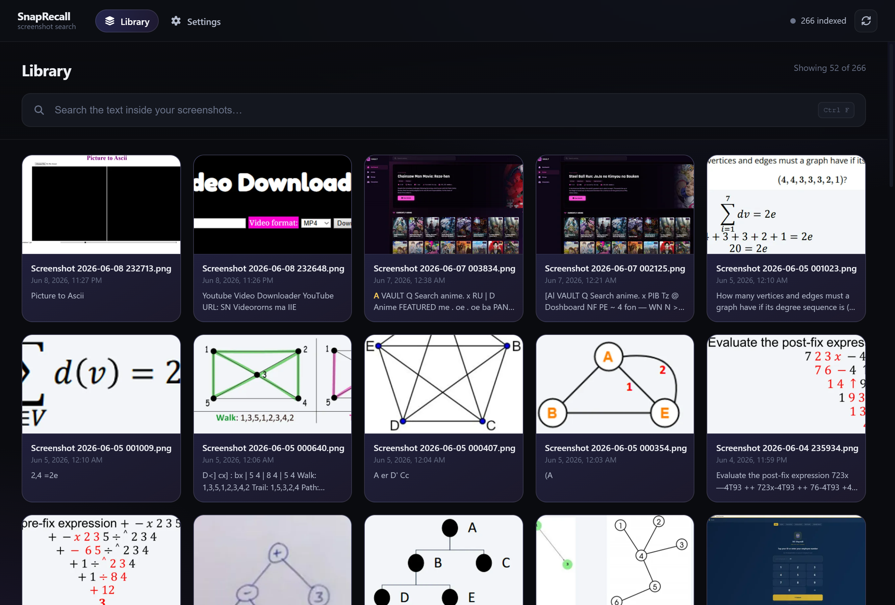

<div align="center">

# 🔎 SnapRecall

**Local-first desktop search across your screenshots, powered by OCR.**

Find anything you ever screenshotted — by the text *inside* the image.

[](https://www.electronjs.org/)
[](https://react.dev/)
[](https://www.typescriptlang.org/)
[](https://vitejs.dev/)
[](https://www.sqlite.org/fts5.html)
[](https://github.com/naptha/tesseract.js)

[](#-installation)


[](LICENSE)

</div>

</div>

---

## 📸 Preview

<div align="center">



</div>

---

## ✨ Overview

People take thousands of screenshots — receipts, errors, chats, slides, codes — and
then can't find anything in them. SnapRecall watches your screenshot folders, reads
the text in every image with OCR, and makes your entire history instantly
searchable. Everything runs on your machine: **no cloud, no accounts, no network.**

## 🚀 Features

- 🗂️ **Automatic folder monitoring** — new, changed, and deleted screenshots are picked up in real time.
- 🔤 **OCR text extraction** — Tesseract reads the text inside each screenshot.
- ⚡ **Instant full-text search** — SQLite FTS5 with relevance ranking and highlighted snippets.
- 🔎 **Flexible queries** — single words, multiple words, prefixes (`invoi*`), and exact phrases (`"connection refused"`).
- 🖼️ **Fast thumbnails** — optimized WebP previews, cached and never regenerated needlessly.
- 📜 **Endless results** — paginated infinite scroll over your whole library.
- 👁️ **Built-in viewer** — open the original, reveal it in your file manager, or copy its path.
- 🔒 **Private by design** — fully offline, no telemetry, your images never leave your device.

## 🧰 Tech Stack

| Area | Technology |
|------|-----------|
| Desktop shell | Electron |
| Language | TypeScript |
| UI | React + Vite |
| Database / search | SQLite + FTS5 (`better-sqlite3`) |
| OCR | Tesseract (`tesseract.js`) |
| Image processing | Sharp |
| File watching | chokidar |
| Validation | Zod |
| Packaging | electron-builder |

## ⬇️ Download

Grab the latest installer for your platform from the
[**Releases page**](https://github.com/JAZSI/SnapRecall/releases/latest):

[](https://github.com/JAZSI/SnapRecall/releases/latest)

| Platform | Installer |
|----------|-----------|
| 🪟 Windows | `SnapRecall-<version>-x64.exe` |
| 🍎 macOS | `SnapRecall-<version>.dmg` |
| 🐧 Linux | `SnapRecall-<version>.AppImage` · `SnapRecall-<version>.deb` |

> Builds are unsigned. On Windows choose **More info → Run anyway** if SmartScreen
> appears; on macOS right-click the app and pick **Open** the first time.

## 🧑‍💻 Build from source

> **Requirements:** Node.js 18+ and npm.

```bash
git clone https://github.com/JAZSI/SnapRecall.git
cd SnapRecall
npm install        # also rebuilds native modules for Electron
npm run dev        # launch in development with hot reload
```

Build installers yourself with `npm run dist:win`, `npm run dist:mac`, or
`npm run dist:linux` — output lands in `release/`.

On first launch SnapRecall auto-detects your system screenshot folder and begins
indexing. You can add or remove folders any time in **Settings**.

### Offline OCR data

OCR language data lives in [`resources/tessdata/`](resources/tessdata/README.md).
English is fetched with `npm run fetch:lang`; add more languages by Tesseract code.

## 🖥️ Usage

1. Type in the search bar (or press <kbd>Ctrl</kbd>/<kbd>Cmd</kbd> + <kbd>F</kbd>).
2. Results stream in ranked by relevance, with the matching text highlighted.
3. Click a result to open the viewer, then **open**, **reveal**, or **copy path**.
4. Scroll to load more — the whole library is reachable.

## 🛠️ Scripts

| Script | Description |
|--------|-------------|
| `npm run dev` | Run the app with hot reload. |
| `npm run build` | Type-check and bundle main, preload, and renderer. |
| `npm run typecheck` | Type-check the entire project. |
| `npm run lint` | Lint with ESLint. |
| `npm run format` | Format with Prettier. |
| `npm run fetch:lang` | Download Tesseract language data. |
| `npm run dist:win` / `dist:mac` / `dist:linux` | Build platform installers. |

## 🏗️ Architecture

SnapRecall follows a layered, ports-and-adapters design. The **main process** owns
all I/O — the SQLite database (WAL + FTS5), the file watcher, a durable
bounded-concurrency processing queue, Tesseract OCR workers, and Sharp thumbnails.
The **renderer** is a sandboxed React UI that communicates only through a typed
preload bridge (`window.snap`). Images are served to the UI through validated
custom protocols rather than raw file paths.

```text
src/
├── main/               # Electron main process (backend)
│   ├── domain/         # Entities, value objects, ports
│   ├── application/    # Use-cases: indexing, search, settings
│   ├── infrastructure/ # Adapters: SQLite, OCR, Sharp, chokidar, config
│   ├── ipc/            # Typed IPC handlers
│   └── bootstrap/      # Window, protocols, composition root
├── preload/            # Secure contextBridge API
├── renderer/           # React UI (search, viewer, settings)
└── shared/             # Cross-process contracts, types, constants
```

## 🔐 Privacy

SnapRecall performs **zero network requests** for its core features. Your
screenshots are read in place, never copied to the cloud, and never transmitted.
There are no accounts and no analytics.

## 📄 License

Released under the [MIT License](LICENSE).
